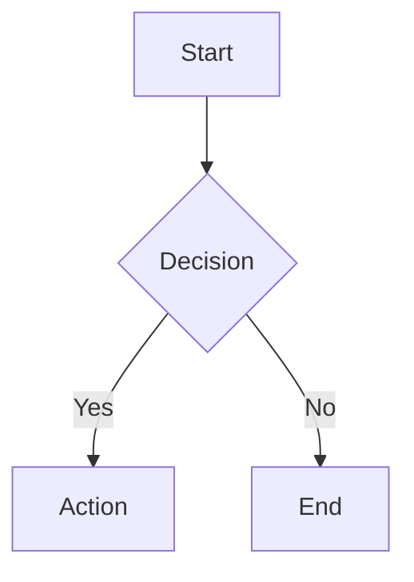
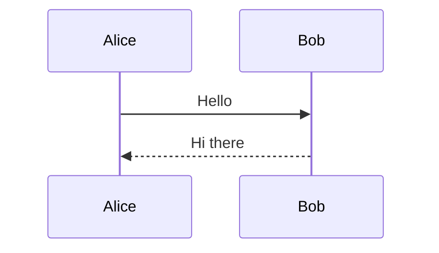
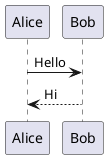

# HackMD Markdown Cheatsheet

HackMD renders CommonMark + GitHub Flavored Markdown (GFM) + HackMD-specific extensions.

---

## CommonMark Basics

```markdown
# Heading 1
## Heading 2
### Heading 3

**bold**   _italic_   ~~strikethrough~~   `inline code`

[Link text](https://example.com)


> Blockquote

---   (horizontal rule)
```

### Lists

```markdown
- Unordered item
- Another item
  - Nested item

1. Ordered item
2. Second item
   1. Nested ordered
```

### Code Blocks

````markdown
```javascript
const x = 1;
```

```python
print("hello")
```
````

---

## GitHub Flavored Markdown (GFM)

### Tables

```markdown
| Column A | Column B | Column C |
|---|---|---|
| Cell 1   | Cell 2   | Cell 3   |
| Cell 4   | Cell 5   | Cell 6   |
```

### Task Lists

```markdown
- [x] Completed task
- [ ] Pending task
- [ ] Another pending task
```

### Auto-links

URLs and email addresses are automatically linked: `https://example.com`

---

## HackMD-Specific Extensions

### Table of Contents

Place `[TOC]` anywhere in the note to generate an automatic table of contents
from headings.

```markdown
[TOC]
```

### YAML Front Matter

Optional metadata block at the very top of the note:

```yaml
---
title: My Note Title
description: A brief description
tags: engineering, retrospective
robots: noindex
---
```

### Admonition Blocks

```markdown
:::info
Informational callout — blue
:::

:::success
Success callout — green
:::

:::warning
Warning callout — yellow
:::

:::danger
Danger/error callout — red
:::

:::spoiler Click to reveal
Hidden content revealed on click
:::
```

### KaTeX Math

Inline math (single `$`):
```
The formula is $E = mc^2$.
```

Block math (double `$$`):
```
$$
\int_0^\infty e^{-x^2} dx = \frac{\sqrt{\pi}}{2}
$$
```

### Mermaid Diagrams

````markdown

````



Supported diagram types: `graph`, `sequenceDiagram`, `gantt`, `classDiagram`,
`stateDiagram`, `pie`, `erDiagram`, `journey`.

### PlantUML Diagrams

````markdown

````

### Embed Macros

Embed a YouTube video:
```

```

Embed a Vimeo video:
```

```

Embed a PDF (via URL):
```

```

### Slide Mode

Use `---` to separate slides when presenting notes as a slideshow (requires
HackMD slide mode to be enabled via the "…" menu).

---

## Keyboard Shortcuts (HackMD Editor)

| Action | Mac | Windows/Linux |
|---|---|---|
| Bold | `⌘B` | `Ctrl+B` |
| Italic | `⌘I` | `Ctrl+I` |
| Heading | `⌘H` | `Ctrl+H` |
| Link | `⌘K` | `Ctrl+K` |
| Code block | `⌘⇧C` | `Ctrl+Shift+C` |
| Save | `⌘S` | `Ctrl+S` |
